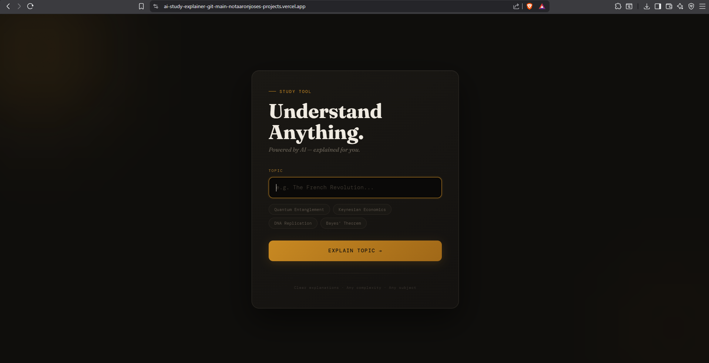

## 🚀 Demo

🧠 AI Study Explainer

Turn complex text into simple, structured explanations using AI

🌐 Live Demo:
https://ai-study-explainer-git-main-notaaronjoses-projects.vercel.app/

🚀 Overview

AI Study Explainer is an AI-powered web application that simplifies long, complex text into clear and structured explanations.

It leverages transformer-based models to help students, developers, and researchers quickly understand large amounts of information with minimal effort.

✨ Features
📄 Smart Text Summarization
Converts lengthy content into concise explanations
🧾 Bullet Point Mode
Breaks down summaries into easy-to-read key points
📌 Auto Title Generation
Generates a meaningful title for any input
⚡ Handles Large Text (Chunking)
Processes long inputs without losing information
🎛️ Multiple Modes
Short
Balanced
Detailed
🧹 Text Cleaning Engine
Removes links, noise, and unnecessary formatting
🛠️ Tech Stack
Frontend: Streamlit
Backend: Python
AI Model: facebook/bart-large-cnn (Hugging Face Transformers)
Libraries: transformers, torch, regex
Deployment: Vercel + Ngrok
⚙️ How It Works
User pastes input text
Text is cleaned and preprocessed
Large text is split into chunks
Each chunk is summarized using the AI model
Results are combined and refined
Final output:
Generated title
Bullet points or paragraph summary
🧪 Example

Input:
Long technical content (500+ words)

Output:

Key bullet points
Concise explanation
Auto-generated title

📊 Reduces reading time by ~70–80%

🚀 Installation & Setup
1. Clone the repository
git clone https://github.com/NOTAaronjose/ai-study-explainer.git
cd ai-study-explainer
2. Install dependencies
pip install transformers torch streamlit sentencepiece rouge-score pyngrok
3. Run the app
streamlit run app.py
🌍 Run on Google Colab
!pip install streamlit pyngrok transformers torch

from pyngrok import ngrok
ngrok.set_auth_token("YOUR_TOKEN")

!streamlit run app.py &

public_url = ngrok.connect(8501)
print(public_url)

⚠️ Important:
Never commit your ngrok token to GitHub.

🎯 Use Cases
📚 Study & revision
🧪 Research papers
📰 Articles & blogs
💼 Productivity workflows
🔮 Future Improvements
📂 PDF / DOCX upload
🧠 Flashcard generation
🎙️ “Explain Like I’m 10” mode
🌙 Dark mode UI
⚡ Faster models
👨‍💻 Author

Aaron Jose Fernandez

GitHub: https://github.com/NOTAaronjose
LinkedIn: https://www.linkedin.com/in/aaron-jose-2aa1b8338/
⭐ Support

If you like this project, give it a ⭐ on GitHub!

🚀 Push it now
git add README.md
git commit -m "Updated README for AI Study Explainer"
git push origin main
